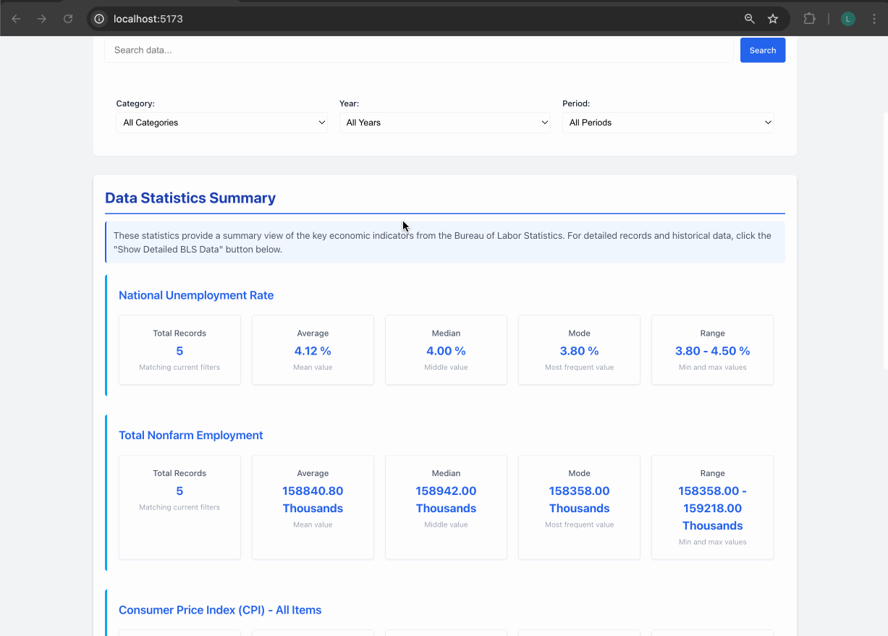

# Bureau of Labor Statistics Data Explorer 📊🌎

A modern React application that fetches, displays, and lets you explore U.S. economic data from the Bureau of Labor Statistics (BLS) API.

## 🚀 Live Demo



## 📝 Features

- ✅ Fetch and display key economic indicators:
  - Unemployment Rate, Consumer Price Index (CPI), Producer Price Index (PPI), Total Nonfarm Employment
- 🔍 Search and filter by category, subcategory, year, period, or state
- 📈 Interactive statistics: Total Records, Average, Median, Mode, Range
- 📱 Responsive design for mobile and desktop
- ⚡ Real-time data updates & loading states
- ❗ Error handling for API failures

## ⚙️ Installation

1. Clone the repo:
   ```bash
   git clone <your-repo-url>
   cd project-5-leeovalle
   ```
2. Install dependencies:
   ```bash
   npm install
   ```
3. Create a `.env` file in the root directory with your BLS API key:
   ```bash
   VITE_BLS_API_KEY=YOUR_BLS_API_KEY
   ```
4. Start the development server:
   ```bash
   npm run dev
   ```

## 🔧 Configuration

Sign up for a free API key at [BLS Developers](https://www.bls.gov/developers/) and add it to your `.env`.

## 🛠️ Usage

- Navigate between **All Data**, **National Data**, and **State Data** tabs  
- Use the search bar to search by term or state name  
- Apply multiple filters to drill down on the data  
- View summary statistics in the **Data Statistics Summary** panel  
- Click "Show Detailed BLS Data" to view raw records

## 📦 Technology Stack

- **React 19** + **Vite**  
- Custom React Hooks & Utilities  
- CSS Modules

## 👤 Author

Lee Ovalle

## 📄 License

This project is licensed under the MIT License.
